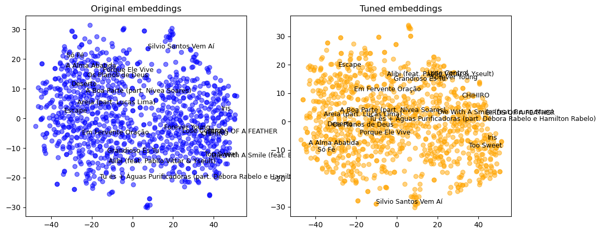

# NLP APS2 Rodrigo Nigri Griner
## Author
Rodrigo Nigri Griner

## 1. Encontrar Dataset & Embeddings

O dataset utilizado no projeto foi produzido a partir de um web scraping do site [Letras.mus.br](https://www.letras.mus.br/). O dataset contém 1000 músicas do estilo pop de artistas variados. As músicas foram extraídas e armazenadas em um arquivo CSV. Cada linha do arquivo representa uma música, contendo informações como título, artista e letra. Observe abaixo uma amostra do dataset:

Titulo-Artista|Letra
---|---
Die With A Smile (feat. Bruno Mars)-Lady Gaga|"Ooh I I just woke up from a dream Where you and I had to say goodbye And I don't know what it all means ..."
Sugar-Maroon 5|"I'm hurting, baby, I'm broken down I need your loving, loving I need it now When I'm without you, I'm something weak You got me begging ..."
... | ...

Para gerar embeddings para o dataset, foi escolhida a representação de vetores pré-treinados GloVe. Primeiramente cada letra foi convertida em embeddings utilizando o modelo GloVe, mais especificamente o modelo `glove.6B.300d.txt`. Esse modelo contém vetores de 300 dimensões que representam palavras individuais, de modo que palavras com significados semelhantes estejam mais próximas no espaço vetorial. Em seguida, foi aplicado um autoencoder para reduzir a dimensionalidade dos embeddings de 300 para 50 dimensões. O autoencoder é composto por duas camadas densas: uma camada de codificação que reduz a dimensionalidade do embedding de 300 para 100, e uma camada de decodificação que reconstrói o embedding original. Os hiperparâmetros incluem uma taxa de aprendizado de 0.001 e 10 épocas de treinamento.

The training process for the auto-encoder involves minimizing the Mean Squared Error (MSE) between the input and the reconstructed embeddings. MSE is an appropriate loss function here because it directly penalizes large differences between the original and reconstructed vectors, which helps the auto-encoder learn a compressed representation that captures the most significant features of each embedding. By minimizing MSE, the auto-encoder learns to remove noise and redundancy, making the reduced embeddings more meaningful for similarity-based retrieval tasks.

O processo de treinamento do autoencoder envolve a minimização do Erro Quadrático Médio (MSE) entre a entrada e os embeddings reconstruídos. MSE é uma função de perda apropriada aqui porque penaliza diretamente grandes diferenças entre os vetores originais e reconstruídos, o que ajuda o autoencoder a aprender uma representação comprimida que captura as características mais significativas de cada embedding. Ao minimizar o MSE, o autoencoder aprende a remover ruído e redundância, tornando os embeddings reduzidos mais significativos para tarefas de recuperação baseadas em similaridade.

## 2. Visualizar os embeddings

A visualização dos embeddings revela uma diferença clara entre as representações originais e as tunadas. No gráfico dos embeddings originais, observam-se grandes clusters que refletem as duas línguas presentes no dataset (português e inglês), indicando que o modelo GloVe, ao ser treinado com palavras individuais, priorizou diferenças linguísticas sobre similaridades semânticas entre as músicas. No entanto, ao passar pelo autoencoder, os embeddings tunados exibem clusters menores e mais bem definidos, onde músicas com temas ou estilos semelhantes tendem a estar mais próximas, independentemente da língua. Esse comportamento sugere que o autoencoder conseguiu capturar nuances semânticas que o GloVe isolado não captava, resultando em uma organização mais homogênea e intuitiva para consultas por similaridade.

Além de facilitar a identificação de músicas similares, a redução dimensional de 300 para 50 dimensões melhora a eficiência de armazenamento e processamento dos dados. Essa nova estrutura vetorial mais densa e balanceada elimina ruídos e detalhes redundantes, mantendo apenas os aspectos mais relevantes de cada embedding, o que ajuda a diminuir falsos positivos nas buscas. 

## 3. Testar o sistema de busca

As 3 queries utilizadas para testar o sistema de busca foram:

1. "When the days are cold\nAnd the cards all fold\nAnd the saints we see\nAre all made of gold When your dreams all fail\nAnd the ones we hail"

>Nessa primeira query, foram retornadas 10 músicas, sendo a mais similar à query a música "Demons" da banda Imagine Dragons, com uma distância de 0,0.

2. "Burnin in your eyes"

>A segunda query retornou 7 resultados, com a música "Video Games" da cantora Lana Del Rey sendo a mais próxima, com uma distância de 3,00.

3. "When you try your best"

>A terceira query tinha como objetivo testar um resultado não óbvio. Esse caso se destaca porque, embora o padrão observado sugira que consultas mais longas tendem a retornar músicas com distâncias menores, essa query de apenas 6 palavras conseguiu identificar uma correspondência bastante próxima. Das 10 músicas retornadas, a mais similar foi "Fix You" da banda Coldplay, com uma distância de 1,98.

## Referências

- GloVe (2014): https://aclanthology.org/D14-1162/
- https://www.letras.mus.br/
